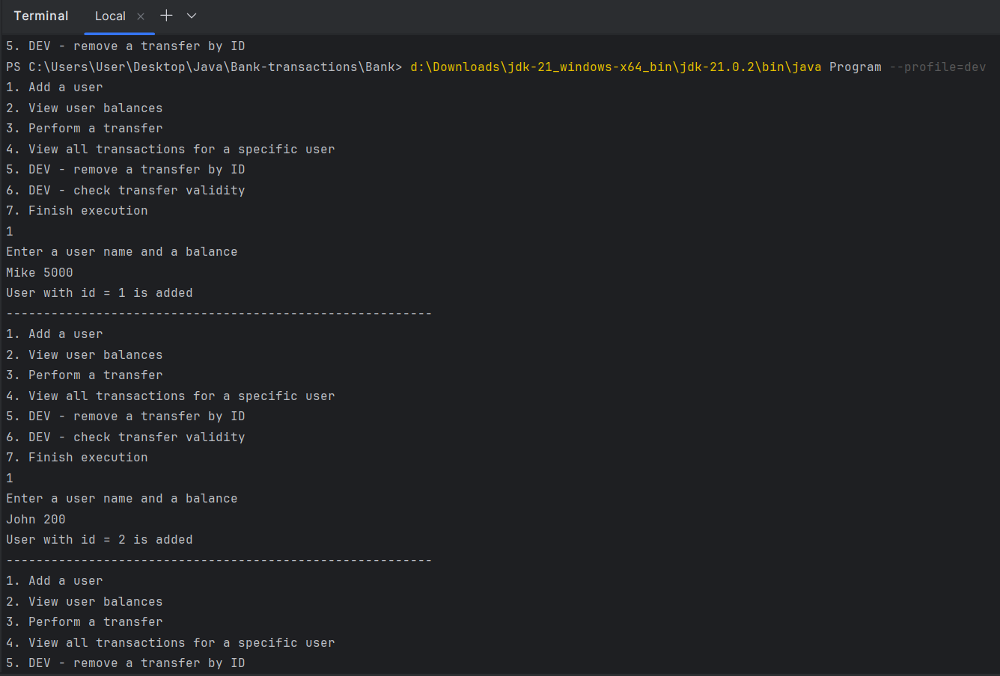

# Bank-transactions
Bank transactions
## Описание проекта
Проект представляет собой систему управления пользователями и транзакциями с поддержкой уникальных идентификаторов, различных интерфейсов для хранения данных и обработкой транзакций. Реализована консольная программа с меню, поддерживающая как стандартный режим, так и режим разработчика для тестирования и проверки данных.

## Основные компоненты
**1. User**

   Класс, представляющий пользователя системы. Основные поля:
- Identifier: Уникальный идентификатор пользователя.
- Name: Имя пользователя.
- Balance: Баланс пользователя.

**2. Transaction**
   
Класс, представляющий транзакцию между двумя пользователями. Основные поля:

- Identifier: Уникальный идентификатор транзакции (UUID).
- Recipient: Получатель (тип User).
- Sender: Отправитель (тип User).
- Transfer category: Категория перевода (дебет/кредит).
- Transfer amount: Сумма перевода.

**3. UserIdsGenerator**

   Класс для генерации уникальных идентификаторов пользователей. Применяет принцип автонумерации, где каждый новый ID равен предыдущему значению +1. Реализован по шаблону Singleton для обеспечения уникальности идентификаторов.

**4. UsersList**

   Интерфейс для управления списком пользователей. Методы:

- addUser(User user): Добавить пользователя.
- getUserById(Long id): Получить пользователя по ID.
- getUserByIndex(int index): Получить пользователя по индексу.
- getNumberOfUsers(): Получить количество пользователей.

**5. UsersArrayList**

   Класс, реализующий UsersList с использованием массива для хранения пользователей. При переполнении массива его размер увеличивается на половину. Исключение UserNotFoundException выбрасывается при попытке получить пользователя с несуществующим ID.

**6. TransactionsList**

   Интерфейс для управления списком транзакций. Методы:

- addTransaction(Transaction transaction): Добавить транзакцию.
- removeTransactionById(String id): Удалить транзакцию по ID.
- toArray(): Преобразовать список транзакций в массив.

**7. TransactionsLinkedList**

   Класс, реализующий TransactionsList с использованием связанного списка. Каждая транзакция содержит ссылку на следующую транзакцию. Исключение TransactionNotFoundException выбрасывается при попытке удалить транзакцию с несуществующим ID.

**8. TransactionsService**

   Сервисный класс для управления пользователями и транзакциями. Методы:
- addUser(User user): Добавить пользователя.
- getUserBalance(Long userId): Получить баланс пользователя.
- performTransfer(Long senderId, Long recipientId, double amount): Выполнить перевод между пользователями.
- getUserTransfers(Long userId): Получить список транзакций пользователя.
- removeTransaction(Long userId, String transactionId): Удалить транзакцию у пользователя.
- checkTransactionValidity(): Проверить корректность всех транзакций.

**9.Menu**

   Класс для взаимодействия с пользователем через консольное меню. Поддерживает два режима:

Production: Стандартный режим работы.

Dev: Режим разработчика для удаления информации о переводах и проверки корректности всех переводов.

Пример работы программы:
